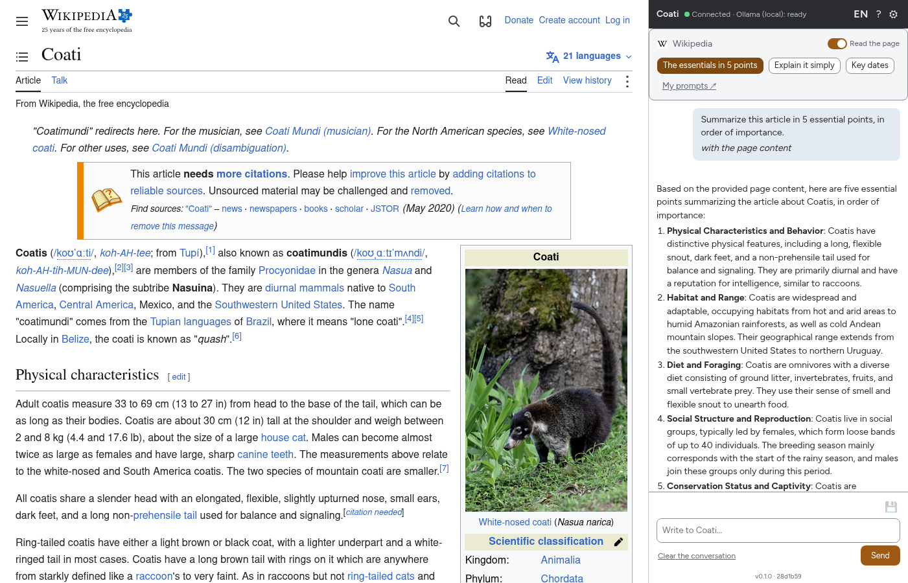

# Coati

Page shown: Wikipedia, "Coati" (text and image under CC BY-SA). Answer generated locally by
`llama3.2` through Ollama.

## Quick start (English)

Coati is a browser side panel that summarises the page or video you are viewing and reworks
selected text, using a model of your choice. Your API keys and credentials are held by a local
program running on 127.0.0.1 — never inside the extension.

**Requirements:** Chrome, Chromium, Brave, or Edge (Firefox: see docs/FIREFOX.md).
The default provider is Ollama; any OpenAI-compatible API or Claude API key also works.

1. Go to the [Releases page](https://github.com/CARL-Bouvet/coati/releases) and download, from
   the same release: the binary for your OS, `SHA256SUMS`, and the "Source code" archive.
2. Verify the checksum (Linux: `sha256sum --check --ignore-missing SHA256SUMS`;
   macOS: `shasum -a 256 <binary>`; Windows PowerShell: `Get-FileHash <binary> -Algorithm SHA256`).
3. Decompress the "Source code" archive and run the installer inside it, passing the binary path
   as argument (see [docs/INSTALL.md](docs/INSTALL.md) for exact commands per OS).
4. Load the extension unpacked: open `chrome://extensions`, enable Developer mode, click
   "Load unpacked", and choose the `extension/` folder from the decompressed archive.
5. Install a model: `ollama pull llama3.2` (~2 GB; any Ollama chat model works).
6. In the extension's settings ("Open settings" in the side panel), choose provider
   **Ollama (local)** and pick `llama3.2` in the model list.
7. Click the Coati icon in the toolbar to open the side panel, then click **Read the page**.

Detailed guide (French): [docs/INSTALL.md](docs/INSTALL.md). Report issues via
[GitHub Issues](https://github.com/CARL-Bouvet/coati/issues).

---

Un compagnon dans le navigateur : un panneau latéral qui répond, résume la page ou la vidéo
qu'on regarde, et retravaille le texte qu'on sélectionne.

Deux morceaux :

- **`extension/`** — l'extension Chromium (Manifest V3). Elle n'appelle jamais un fournisseur
  d'IA directement, et ne détient aucun identifiant.
- **`broker/`** — un petit serveur qui tourne sur la machine de l'utilisateur, écoute sur
  `127.0.0.1` seulement, détient la configuration et parle au modèle. L'extension lui parle en
  WebSocket.

Le contrat entre les deux est figé dans [`docs/PROTOCOL.md`](docs/PROTOCOL.md). Les décisions de
conception et ce qui les motive sont dans [`docs/DECISIONS.md`](docs/DECISIONS.md).

## Pourquoi un broker

Le stockage d'une extension n'est pas chiffré sur le disque, et une extension est exposée à
toutes les pages que l'utilisateur visite. Mettre les identifiants ailleurs — dans un processus
local que le navigateur ne peut qu'interroger — retire le secret de la zone de souffle.

Le prix à payer est une contrainte récente de Chrome : joindre `127.0.0.1` depuis une page
déclenche une demande de permission (Local Network Access). Les WebSockets y échappent encore ;
c'est pour ça que le transport en est un. Voir `docs/PROTOCOL.md`.

## État

Version 0.1.0 en test public. Les exécutables ne sont pas encore signés par Apple ou Microsoft
(voir « Exécutables non signés » dans [docs/INSTALL.md](docs/INSTALL.md)) et l'extension n'est
pas encore publiée sur le Chrome Web Store ni sur AMO : elle se charge en mode développeur.
Les retours se font via les [issues GitHub](https://github.com/CARL-Bouvet/coati/issues).

## Licence

AGPL-3.0 — voir [`LICENSE`](LICENSE). Le nom et le logo Coati ne sont pas couverts par la licence
AGPL.

Le code est ouvert parce que c'est la seule façon de rendre vérifiable ce que Coati promet : le
contenu des pages ne quitte pas la machine. Plusieurs extensions concurrentes ont promis la même
chose par écrit et ont été démenties par analyse de trafic ; la différence tient à ce qu'on peut
lire le code plutôt qu'à ce qu'on affirme. Chaque ligne qui touche aux données de l'utilisateur est
dans ce dépôt.

## Langues de l'interface

L'interface est disponible en français, anglais et chinois simplifié.
The Chinese interface is machine-translated and awaits review by a native speaker.
中文界面由机器翻译生成，尚待母语者审校。

## Installer

Les exécutables du broker sont sur la page des
[versions publiées](https://github.com/CARL-Bouvet/coati/releases). L'installation (Linux, macOS,
Windows), l'installation depuis les sources et le dépannage sont décrits dans
[`docs/INSTALL.md`](docs/INSTALL.md).
